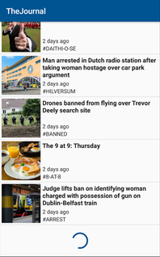

TheJournal test app
==============

This project is a sample app developed to demostrate the usage of the clean architecture.
As demonstration, it has been implemented a feed of news

{:height="160px" width="100px"}.
### Library used

| Library | Motivation |
| ------ | ------ |
| Dagger2 | Used to provide Dependency Injection |
| Mockito | Used for testing |
| Picasso | Used to load and cache images |
| Retrofit | Used to make network requests |
| RxJava | Used to avoid circular dependency between presenters and views creating observable objects, so that the views act as provider for async events and presenters consume and call views methods.  |